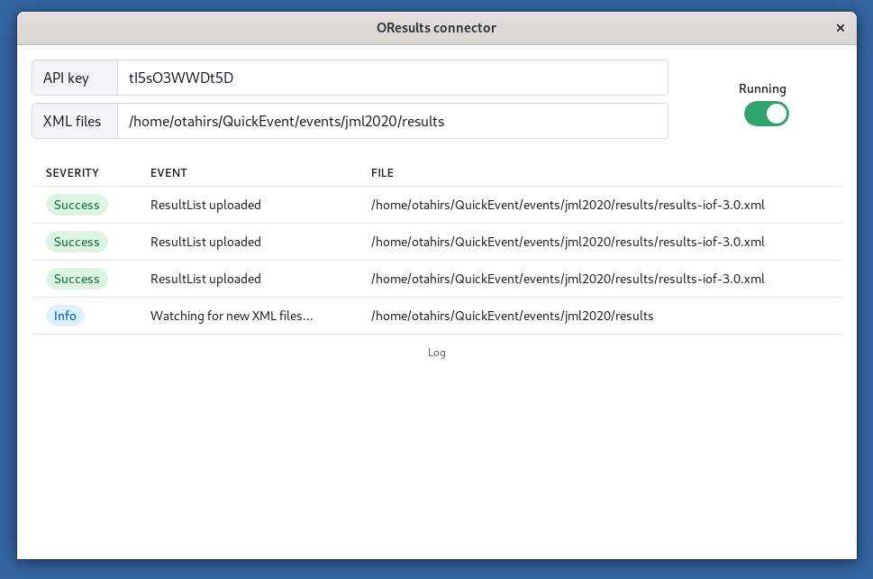

# OResults connector
Tool for automatic upload of start list and result files to OResults. It uploads files from a given folder as they are created or modified. 

Part of the [OResults](https://oresults.eu) platform. See [docs for organizers](https://docs.oresults.eu) for more details.

### Download 
See [Releases](https://github.com/oresults/oresults-connector/releases).

---
# Use integrated services instead
### QuickEvent
If you use [QuickEvent](https://github.com/Quick-Event/quickbox), you can use the integrated OResults Connector service.

### MeOS
If you use [MeOs](https://www.melin.nu/meos/en/), you can use the MeOS Online Protocol XML v2 in the services menu. The api endpoint is `https://api.oresults.eu/meos`, use the event API key as the password.
